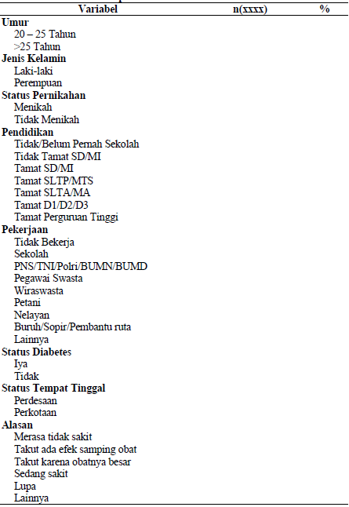
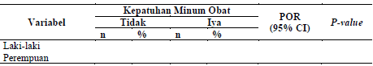
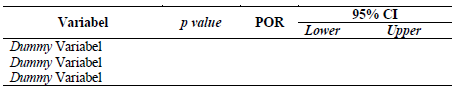

# Pendahuluan {.heading-page}

## Latar Belakang

::::::::::: fragment
:::::: {layout="[33, 33, 33]" layout-valign="top" style="text-align: center;"}
::: {#ncol1 .fragment style="text-align: center;" fragment-index="1"}
**Definisi:**<br>Filariasis adalah penyakit menular kronis akibat infeksi cacing filaria.
:::

::: {#ncol2 .fragment style="text-align: center;"}
**Penyebab:**<br>cacing filaria berupa *W. bancrofti*, *Brugia malayi*, dan *Brugia timori*.
:::

::: {#ncol3 .fragment style="text-align: center;"}
**Epidemiologi Deskriptif:**<br>Dapat menyerang semua kelompok umur, dapat menyerang laki-laki maupun perempuan, dan umumnya ditemukan di wilayah tropis.
:::
::::::

:::::: {layout="[30, 40, 30]" layout-valign="top" style="text-align: center; margin-top: 30px;"}
::: empty-space
:::

::: {#ncol4 .fragment style="text-align: center;"}
**Dampak:**<br>Kecacatan, kemiskinan, dan stigma sosial.
:::

::: empty-space
:::
::::::
:::::::::::

::: {.fragment style="text-align: center;"}
**Solusi Utama:**<br>Eliminasi filariasis dengan melaksanakan dua program utama yaitu Pemberian Obat Pencegahan Massal (POPM) dan penanganan kasus filariasis kronis di fasilitas kesehatan.
:::

::: {.fragment style="text-align: center; margin-top: 50px;"}
Selain itu, pemanfaatan data hasil Survei Kesehatan Indonesia tahun 2023 juga dapat membantu Indonesia dalam mencapai eliminasi filariasis.
:::

::: notes
karena informasi yang dihasilkan dapat digunakan untuk menyusun kebijakan, program, dan kegiatan pembangunan, sehingga kebijakan dan program yang dibentuk lebih terarah dan tepat sasaran.
:::

## Situasi Filariasis

::::: {.columns style="display: flex; column-gap: 100px;"}
::: {.column width="30%"}
**Global:**<br>Pada tahun 2023, sebanyak 657 juta orang di 39 negara memerlukan pemberian obat filariasis secara massal. Diperkirakan terdapat 25 juta orang yang terkena filariasis dengan hidrokel dan lebih dari 15 juta yang mengalami limfedema.
:::

::: {.column width="70%"}
**Indonesia:**<br>Jumlah kasus filariasis di Indonesia dari tahun 2020 – 2024

```{r}
#| fig-width: 9
#| fig-height: 5
#| out-width: "100%"
#| echo: false

library(ggplot2)

data_kasus <- data.frame(
  tahun = 2020:2024,
  jumlah_kasus = c(9906, 9354, 8742, 7955, 5601),
  kasus_baru = c(NA, NA, NA, NA, 66)
)

ggplot(data_kasus, aes(x = tahun)) +
  # 1. Pindahkan color dan fill ke dalam aes()
  geom_line(aes(y = jumlah_kasus, color = "Jumlah Kasus"), linewidth = 2) +
  geom_point(aes(y = jumlah_kasus, color = "Jumlah Kasus"), size = 4) +
  geom_col(aes(y = kasus_baru, fill = "Kasus Baru"), width = 0.5, alpha = 1) +
  
  # 2. Tentukan warna manual agar sesuai keinginan Anda
  scale_color_manual(name = "Keterangan", values = c("Jumlah Kasus" = "#852419FF")) +
  scale_fill_manual(name = "", values = c("Kasus Baru" = "#DEB738FF")) +
  
  # Text labels (tetap seperti semula)
  geom_text(aes(y = jumlah_kasus, label = jumlah_kasus), vjust = 1.7, size = 5) +
  geom_text(aes(y = kasus_baru, label = kasus_baru), vjust = -0.4, size = 5)  +
  labs(x = "Tahun", y = "Jumlah Kasus") +
  theme_bw(base_size = 16) +
  # 3. Opsional: Pindahkan legenda ke bawah agar plot lebih luas
  theme(legend.position = "bottom")
```
:::
:::::

::: notes
Gambar tersebut menunjukkan adanya tren penurunan jumlah kasus filariasis. Penurunan ini terjadi karena adanya penderita filariasis yang meninggal dunia serta adanya perubahan diagnosis setelah dilakukan validasi data dan konfirmasi kasus klinis kronis yang dilaporkan pada tahun sebelumnya. Selain itu, pada tahun 2024 masih ditemukan 66 kasus filariasis kronis baru.
:::

## Target Indonesia

::: incremental
-   Indonesia telah menargetkan eliminasi filariasis pada tahun 2030.
    -   Sejalan dengan *Roadmap* penyakit tropis terabaikan (*Neglected Tropical Diseases*/NTDs) yang diluncurkan oleh *World Health Organization* (WHO) untuk periode 2021 – 2030.
    -   Sejalan dengan target *Sustainable Development Goals* (SDGs) nomor 3 Kehidupan Sehat dan Sejahtera, yaitu pada tahun 2030 mengakhiri epidemi penyakit tropis terabaikan.
:::

::: fragment
Dalam mencapai eliminasi filariasis, Indonesia harus menurunkan angka mikrofilaria menjadi \<1% di seluruh kabupaten/kota endemis.
:::

:::::: fragment
::::: {layout="[60, 40]" layout-valign="top" style="text-align: left;"}
::: {.fragment style="text-align: left;"}
```{r}
#| fig-width: 9
#| fig-height: 5
#| out-width: "80%"
#| echo: false

library(ggplot2)

data_mikrofilaria <- data.frame(
  tahun = 2019:2024,
  jumlah_kabkota = c(119, 128, 190, 201, 208, 206)
)

ggplot(data_mikrofilaria, aes(x = tahun)) +
  # 1. Pindahkan color dan fill ke dalam aes()
  geom_line(aes(y = jumlah_kabkota, color = "Jumlah Kabupaten/Kota"), linewidth = 2) +
  geom_point(aes(y = jumlah_kabkota, color = "Jumlah Kabupaten/Kota"), size = 4) +
  
  # 2. Tentukan warna manual agar sesuai keinginan Anda
  scale_color_manual(name = "Keterangan", values = c("Jumlah Kabupaten/Kota" = "#852419FF")) +
  
  # Text labels (tetap seperti semula)
  geom_text(aes(y = jumlah_kabkota, label = jumlah_kabkota), vjust = 1.7, size = 5) +
  labs(x = "Tahun", y = "Jumlah Kabupaten/Kota") +
  theme_bw(base_size = 15) +
  # 3. Opsional: Pindahkan legenda ke bawah agar plot lebih luas
  theme(legend.position = "bottom")
```
:::

::: {.fragment style="text-align: left;"}
-   Sampai 2021 proses penurunan mikrofilaria \<1% menunjukkan peningkatan yang signifikan.<br>
-   Pada periode 2022 – 2024 proses penurunan mikrofilaria menunjukkan proses yang melambat, kondisi tersebut menunjukkan bahwa Indonesia belum [*on the track*]{.bg style="--col: #DEB738FF"} dalam mencapai eliminasi filariasis pada 2030.
:::
:::::
::::::

::: notes
Total kabupaten/kota di Indonesia yang endemis filariasis adalah 236.
:::

------------------------------------------------------------------------

Dalam upaya menurunkan mikrofilaria menjadi \<1%, Indonesia melaksanakan kegiatan POPM filariasis pada seluruh penduduk di daerah endemis dengan cakupan minimal yang harus dicapai [sebesar 65%]{.bg style="--col: #DEB738FF"}.

::::: {.columns style="display: flex; column-gap: 100px; margin-top: 50px;"}
::: {.column width="30%"}
Hingga tahun 2024, cakupan POPM filariasis di Indonesia menunjukkan [kecenderungan menurun]{.bg style="--col: #DEB738FF"} sejak tahun 2019.
:::

::: {.column width="70%"}
Cakupan POPM filariasis di Indonesia dari tahun 2019 – 2024

```{r}
#| fig-width: 9
#| fig-height: 5
#| out-width: "100%"
#| echo: false

library(ggplot2)

data_popm <- data.frame(
  tahun = 2019:2024,
  cakupan_popm = c(79.3, 69, 71.5, 58.7, 51.7, 44.2)
)

ggplot(data_popm, aes(x = tahun)) +
  # 1. Pindahkan color dan fill ke dalam aes()
  geom_line(aes(y = cakupan_popm, color = "Cakupan POPM Filariasis"), linewidth = 2) +
  geom_point(aes(y = cakupan_popm, color = "Cakupan POPM Filariasis"), size = 4) +
  
  # 2. Tentukan warna manual agar sesuai keinginan Anda
  scale_color_manual(name = "Keterangan", values = c("Cakupan POPM Filariasis" = "#852419FF")) +
  
  # Text labels (tetap seperti semula)
  geom_text(aes(y = cakupan_popm, label = cakupan_popm), vjust = -1, size = 5) +
  labs(x = "Tahun", y = "Cakupan POPM Filariasis (%)") +
  theme_bw(base_size = 15) +
  # 3. Opsional: Pindahkan legenda ke bawah agar plot lebih luas
  theme(legend.position = "bottom")
```
:::
:::::

::: notes
Cakupan POPM filariasis mencerminkan tingkat partisipasi masyarakat dalam upaya memutus rantai penularan filariasis melalui pelaksanaan POPM. Sejumlah studi sebelumnya menunjukkan bahwa rendahnya tingkat kepatuhan terhadap POPM filariasis menjadi salah satu faktor yang memicu kembali terjadinya penularan filariasis di wilayah yang telah menyelesaikan pelaksanaan POPM. Ketika kepatuhan menurun, efektivitas POPM ikut berkurang sehingga terdapat peluang peningkatan mikrofilaria yang dapat menyebabkan penularan baru.
:::

------------------------------------------------------------------------

Penurunan cakupan POPM tersebut juga diikuti dengan [penurunan tingkat kepatuhan pengobatan]{.bg style="--col: #DEB738FF"} pada penderita filariasis di Indonesia.

::: incremental
-   Studi yang dilakukan oleh Ipa dkk. di Indonesia menggunakan data Riskesdas 2018 menunjukkan bahwa tingkat kepatuhan pengobatan penderita filariasis di Indonesia sebesar [70%]{.bg style="--col: #DEB738FF"}.
-   Berdasarkan hasil SKI 2023, kepatuhan pengobatan penderita filariasis di Indonesia adalah [33%]{.bg style="--col: #DEB738FF"}.
:::

::: {.fragment style="text-align: center;"}
[**Kepatuhan selama pengobatan merupakan faktor utama yang menentukan efektivitas pengobatan.**]{.fg style="--col: #852419FF"}
:::

:::::: fragment
::::: {layout="[50, 50]" layout-valign="top" style="text-align: left; margin-top: 30px;"}
::: {.fragment style="text-align: left;"}
WHO melalui teori *Adherence to long-term therapies* menjelaskan terdapat 5 dimensi yang dapat mempengaruhi kepatuhan pengobatan.<br> 1. *social and economic factors*.<br> 2. *health care team and system-related factors*.<br> 3. *condition-related factors*.<br> 4. *therapy-related factors*.<br> 5. *patient-related factors*.<br>
:::

::: {.fragment style="text-align: left;"}
Studi yang dilakukan oleh Ipa dkk. diketahui pada *dimensi social and economic factors* terdapat.<br> 1. Umur (AOR = 0,78; 95%CI = 0,77 – 0,79)<br> 2. Jenis kelamin (AOR = 1,02; 95%CI = 1,01 – 1,03)<br> 3. tingkat pendidikan (AOR = 1,35; 95%CI = 1,33 – 1,38)<br> 4. pekerjaan (AOR = 1,25; 95%CI = 1,23 – 1,26)<br> 5. status pernikahan (AOR = 0,93; 95%CI = 0,91 – 0,94)<br> 6. sosial ekonomi (AOR = 1,25; 95%CI = 1,23 – 1,27)<br> 7. status tempat tinggal (AOR = 0,82; 95%CI = 0,81 – 0,83)<br>
:::
:::::
::::::

::: notes
Kepatuhan yang rendah dapat mengurangi manfaat klinis yang optimal. Sebaliknya, kepatuhan yang baik dapat meningkatkan efektivitas pengobatan, termasuk pengobatan dengan tujuan pengurangan risiko untuk munculnya dampak yang tidak diinginkan berbasis farmakologis.
:::

------------------------------------------------------------------------

Pada dimensi *condition-related factors* terdapat variabel status komorbid juga memiliki hubungan yang signifikan.

::: {.fragment style="margin-top: 30px;"}
Berbeda dengan studi lain oleh Kesuma dkk. dengan variabel pada dimensi yang sama dimana status tempat tinggal tidak memiliki hubungan dengan kepatuhan penderita filariasis dalam mengonsumsi obat (AOR = 0,99; 95%CI = 0,96 – 1,0).
:::

::: {.fragment style="text-align: center; margin-top: 30px;"}
Studi Ipa dkk. yang menggunakan data Riskesdas 2018 belum memuat informasi mengenai alasan penderita filariasis tidak minum obat. Namun, pada SKI 2023 tersedia pertanyaan baru berupa [Alasan UTAMA individu tidak minum obat sebagian atau seluruhnya]{.bg style="--col: #DEB738FF"}.
:::

::: {.fragment style="text-align: center; margin-top: 100px;"}
[**Rumusan Masalah**]{.fg style="--col: #852419FF"}
:::

::: {.fragment style="text-align: center; margin-top: 20px;"}
Apa saja faktor-faktor yang berhubungan dengan kepatuhan pengobatan pada penderita filariasis di Indonesia?
:::

## Tujuan Penelitian

### Tujuan Umum {style="text-align: center;"}

::: {.fragment style="text-align: center; margin-top: 20px;"}
Untuk mengetahui faktor-faktor yang berhubungan dengan kepatuhan pengobatan pada penderita filariasis di Indonesia.
:::

### Tujuan Khusus

::: fragment
1.  Mengetahui distribusi dan frekuensi kepatuhan pengobatan penderita filariasis, karakteristik responden (umur, jenis kelamin, status pernikahan, tingkat pendidikan, status pekerjaan, status diabetes, status wilayah, dan alasan tidak minum obat) di Indonesia berdasarkan hasil SKI 2023.
2.  Mengetahui sebaran tingkat kepatuhan pengobatan penderita filariasis per provinsi di Indonesia berdasarkan hasil SKI 2023.
3.  Mengetahui hubungan umur, jenis kelamin, status pernikahan, tingkat pendidikan, status pekerjaan, status diabetes, status wilayah, dan alasan tidak minum obat dengan kepatuhan pengobatan penderita filariasis di Indonesia berdasarkan hasil SKI 2023.
4.  Mengetahui faktor dominan yang mempengaruhi kepatuhan pengobatan penderita filariasis di Indonesia berdasarkan hasil SKI 2023.
:::

## Manfaat Penelitian

:::::: columns
::: {.column width="33%"}
**Manfaat Teoritis:**<br> Sebagai sumber informasi dan memperkaya pemahaman terkait faktor-faktor yang berhubungan dengan kepatuhan pengobatan filariasis di Indonesia.
:::

::: {.column width="33%"}
**Manfaat Akademis:**<br> Dapat memberikan kontribusi sebagai sumber pengetahuan dan materi pembelajaran, serta penerapan ilmu epidemiologi.
:::

::: {.column width="33%"}
**Manfaat Praktis:**<br> 1. Bagi Pemerintah<br> Dapat menjadi acuan dalam pengambilan keputusan untuk merumuskan kebijakan, khususnya terkait upaya pencegahan dan pengendalian filariasis di Indonesia.<br> 2. Bagi Fakultas Kesehatan Masyarakat<br> sebagai referensi dan sumber informasi untuk mendukung pengembangan studi lebih lanjut.<br> 3. Bagi Peneliti Selanjutnya<br> dapat menjadi salah satu referensi dalam mendukung pembaruan penelitian.
:::
::::::

## Ruang Lingkup Penelitian

Penelitian ini membahas faktor-faktor yang berhubungan dengan kepatuhan pengobatan pada penderita filariasis di Indonesia merupakan penelitian kuantitatif dengan desain studi *cross sectional*. Data yang digunakan merupakan data sekunder dari Survei Kesehatan Indonesia tahun 2023. Terdapat 8 variabel independen dan 1 variabel dependen. analisis yang akan dilakukan mencakup analisis univariat, bivariat, dan multivariat, serta pemetaan.

# Tinjauan Pustaka {.heading-page}

## Tinjauan Pustaka

::::: columns
::: {.column width="50%"}
**A. Filariasis**<br> 1. Definisi<br> 2. Epidemiologi<br> 3. Etiologi<br> 4. Penularan<br> 5. Masa inkubasi<br> 6. Gejala<br> 7. Diagnosis<br> 8. Vektor<br> 9. Pencegahan<br> 10. Pengobatan<br>
:::

::: {.column width="50%"}
**B. Kepatuhan Pengobatan**<br> **C. Faktor yang Berhubungan dengan Kepatuhan Berobat Filariasis**<br>**D. SKI 2023**
:::
:::::

## Kerangka Teori

::: {style="text-align: center;"}
{fig-align="center"}
:::

::: notes
Penyakit yang memiliki satu atau lebih dari karakteristik berikut:<br>
1. bersifat permanen<br>
2. menyebabkan cacat permanen<br>
3. disebabkan oleh perubahan patologis yang<br>
tidak dapat dibalikkan<br>
4. memerlukan pelatihan khusus bagi pasien untuk rehabilitasi<br>
5. diperkirakan memerlukan periode pengawasan, pemantauan, atau perawatan yang
panjang
:::

## Kerangka Konsep

::: {style="text-align: center;"}
{fig-align="center"}
:::

## Hipotesis

1.  Terdapat hubungan antara umur dengan kepatuhan pengobatan penderita filariasis di Indonesia berdasarkan hasil SKI 2023.
2.  Terdapat hubungan antara jenis kelamin dengan kepatuhan pengobatan penderita filariasis di Indonesia berdasarkan hasil SKI 2023.
3.  Terdapat hubungan antara status pernikahan dengan kepatuhan pengobatan penderita filariasis di Indonesia berdasarkan SKI 2023.
4.  Terdapat hubungan antara tingkat pendidikan dengan kepatuhan pengobatan penderita filariasis di Indonesia berdasarkan hasil SKI 2023.
5.  Terdapat hubungan antara status pekerjaan dengan kepatuhan pengobatan penderita filariasis di Indonesia berdasarkan hasil SKI 2023.
6.  Terdapat hubungan antara status diabetes dengan kepatuhan pengobatan penderita filariasis di Indonesia berdasarkan hasil SKI 2023.
7.  Terdapat hubungan antara status wilayah dengan kepatuhan pengobatan penderita filariasis di Indonesia berdasarkan hasil SKI 2023.
8.  Terdapat hubungan antara alasan tidak minum obat dengan kepatuhan pengobatan penderita filariasis di Indonesia berdasarkan hasil SKI 2023.

# Metodologi Penelitian {.heading-page}

------------------------------------------------------------------------

::::: columns
::: {.column width="50%"}
**Jenis Penelitian:**<br> Penelitian kuantitatif dengan desain studi *cross sectional*.
:::

::: {.column width="50%"}
**Waktu dan Tempat:**<br> Waktu: Januari - Maret Tahun 2026.<br> Tempat: Indonesia.
:::
:::::

<br> <br>

**Populasi dan Sampel:**<br> 1. Populasi penelitian mencakup seluruh individu di Indonesia.<br> 2. Sampel penelitian terdiri 515 individu.

## Definisi Operasional {.smaller}

+-------------------------+----------------------+-----------------------------------------------------------------------------------------------------------------------------------------------------------------------------------------------+------------------------------------+----------------------+--------------------+------------+
| No.                     | Variabel             | Definisi Operasional                                                                                                                                                                          | Alat Ukur                          | Cara Ukur            | Hasil Ukur         | Skala Ukur |
+=========================+======================+===============================================================================================================================================================================================+====================================+======================+====================+============+
| **Variabel Dependen**   |                      |                                                                                                                                                                                               |                                    |                      |                    |            |
+-------------------------+----------------------+-----------------------------------------------------------------------------------------------------------------------------------------------------------------------------------------------+------------------------------------+----------------------+--------------------+------------+
| 1\.                     | Kepatuhan Pengobatan | Individu mengonsumsi obat sesuai anjuran tenaga kesehatan setelah didiagnosis menderita filariasis dalam 3 tahun terakhir atau lebih oleh tenaga kesehatan (dokter/perawat/bidan)             | Kuesioner SKI.23 IND (A30 dan A33) | Telaah data SKI 2023 | `0.` Tidak Patuh   | Ordinal    |
|                         |                      |                                                                                                                                                                                               |                                    |                      |                    |            |
|                         |                      |                                                                                                                                                                                               |                                    |                      | `1.` Patuh         |            |
+-------------------------+----------------------+-----------------------------------------------------------------------------------------------------------------------------------------------------------------------------------------------+------------------------------------+----------------------+--------------------+------------+
| **Variabel Independen** |                      |                                                                                                                                                                                               |                                    |                      |                    |            |
+-------------------------+----------------------+-----------------------------------------------------------------------------------------------------------------------------------------------------------------------------------------------+------------------------------------+----------------------+--------------------+------------+
| 1\.                     | Umur                 | Lama hidup responden dihitung dari kelahiran hingga waktu pelaksanaan SKI 2023.                                                                                                               | Kuesioner SKI.23 RT (B4K7)         | Telaah data SKI 2023 | `0.` 20 – 25 Tahun | Ordinal    |
|                         |                      |                                                                                                                                                                                               |                                    |                      |                    |            |
|                         |                      |                                                                                                                                                                                               |                                    |                      | `1.` 25 Tahun      |            |
+-------------------------+----------------------+-----------------------------------------------------------------------------------------------------------------------------------------------------------------------------------------------+------------------------------------+----------------------+--------------------+------------+
| 2\.                     | Jenis Kelamin        | Karakteristik biologis yang ditentukan secara genetik antara laki-laki dan perempuan.                                                                                                         | Kuesioner SKI.23 RT (B4K4)         | Telaah data SKI 2023 | `0.` Laki-laki     | Nominal    |
|                         |                      |                                                                                                                                                                                               |                                    |                      |                    |            |
|                         |                      |                                                                                                                                                                                               |                                    |                      | `1.` Perempuan     |            |
+-------------------------+----------------------+-----------------------------------------------------------------------------------------------------------------------------------------------------------------------------------------------+------------------------------------+----------------------+--------------------+------------+
| 3\.                     | Status Pernikahan    | Seseorang yang hidup sebagai suami atau isteri berdasarkan peraturan hukum/ adat/ ajaran agama, baik yang mendapatkan surat nikah maupun tidak, namun sah menurut hukum / adat/ ajaran agama. | Kuesioner SKI.23 RT (B4K5)         | Telaah data SKI 2023 | `0.` Menikah       | Ordinal    |
|                         |                      |                                                                                                                                                                                               |                                    |                      |                    |            |
|                         |                      |                                                                                                                                                                                               |                                    |                      | `1.` Tidak         |            |
+-------------------------+----------------------+-----------------------------------------------------------------------------------------------------------------------------------------------------------------------------------------------+------------------------------------+----------------------+--------------------+------------+

# Definisi Operasional {.smaller}

+------+------------------------------------+----------------------------------------------------------------------------------------------------------------------------------+-----------------------------+----------------------+----------------------------------+------------+
| No.  | Variabel                           | Definisi Operasional                                                                                                             | Alat Ukur                   | Cara Ukur            | Hasil Ukur                       | Skala Ukur |
+======+====================================+==================================================================================================================================+=============================+======================+==================================+============+
| 4\.  | Tingkat Pendidikan                 | Tingkat pendidikan formal responden tertinggi yang telah ditamatkan/ memperoleh ijazah.                                          | Kuesioner SKI.23 RT (B4K8)  | Telaah data SKI 2023 | `0.` Rendah                      | Ordinal    |
|      |                                    |                                                                                                                                  |                             |                      |                                  |            |
|      |                                    |                                                                                                                                  |                             |                      | `1.` Tinggi                      |            |
+------+------------------------------------+----------------------------------------------------------------------------------------------------------------------------------+-----------------------------+----------------------+----------------------------------+------------+
| 5\.  | Status Pekerjaan                   | Pekerjaan utama responden atau kegiatan yang menggunakan waktu terbanyak.                                                        | Kuesioner SKI.23 RT (B4K9)  | Telaah data SKI 2023 | `0.` Tidak Bekerja               | Ordinal    |
|      |                                    |                                                                                                                                  |                             |                      |                                  |            |
|      |                                    |                                                                                                                                  |                             |                      | `1.` Tidak Bekerja               |            |
+------+------------------------------------+----------------------------------------------------------------------------------------------------------------------------------+-----------------------------+----------------------+----------------------------------+------------+
| 6\.  | Status Diabetes                    | Responden mempunyai penyakit penyerta berupa diabetes melitus.                                                                   | Kuesioner SKI.23 IND ( B07) | Telaah data SKI 2023 | `0.` Iya                         | Ordinal    |
|      |                                    |                                                                                                                                  |                             |                      |                                  |            |
|      |                                    |                                                                                                                                  |                             |                      | `1.` Tidak                       |            |
+------+------------------------------------+----------------------------------------------------------------------------------------------------------------------------------+-----------------------------+----------------------+----------------------------------+------------+
| 7\.  | Status Tempat Tinggal              | Merujuk pada kategori lokasi di mana responden tinggal, yang umumnya dibedakan menjadi dua jenis utama: perdesaan dan perkotaan. | Kuesioner SKI.23 IND (B1N4) | Telaah data SKI 2023 | `0.` Perdesaan                   | Ordinal    |
|      |                                    |                                                                                                                                  |                             |                      |                                  |            |
|      |                                    |                                                                                                                                  |                             |                      | `1.` Perkotaan                   |            |
+------+------------------------------------+----------------------------------------------------------------------------------------------------------------------------------+-----------------------------+----------------------+----------------------------------+------------+
| 8\.  | Alasan Tidak Minum Obat Filariasis | Alasan utama penderita tidak minum obat filariasis.                                                                              | Kuesioner SKI.23 IND (A31)  | Telaah data SKI 2023 | `1.` Merasa tidak sakit          | Ordinal    |
|      |                                    |                                                                                                                                  |                             |                      |                                  |            |
|      |                                    |                                                                                                                                  |                             |                      | `2.` Takut ada efek samping obat |            |
|      |                                    |                                                                                                                                  |                             |                      |                                  |            |
|      |                                    |                                                                                                                                  |                             |                      | `3.` Takut karena obatnya besar  |            |
|      |                                    |                                                                                                                                  |                             |                      |                                  |            |
|      |                                    |                                                                                                                                  |                             |                      | `4.` Sedang sakit                |            |
|      |                                    |                                                                                                                                  |                             |                      |                                  |            |
|      |                                    |                                                                                                                                  |                             |                      | `5.` Lupa                        |            |
|      |                                    |                                                                                                                                  |                             |                      |                                  |            |
|      |                                    |                                                                                                                                  |                             |                      | `6.` Lainnya                     |            |
+------+------------------------------------+----------------------------------------------------------------------------------------------------------------------------------+-----------------------------+----------------------+----------------------------------+------------+

------------------------------------------------------------------------

**Instrumen Penelitian:** Instrumen penelitian yang digunakan terdiri dari kuesioner SKI individu dan kuesioner SKI rumah tangga. <br> <br>

::::: columns
::: {.column width="50%"}
**Instrumen Penelitian:** Data sekunder yang diperoleh dari Badan Kebijakan Kementerian Kesehatan.
:::

::: {.column width="50%"}
**Pengolahan Data:** 1. Menyunting Data (*Editing*)<br> 2. Mengkode Data (*Coding*)<br> 3. Membersihkan Data (*Cleaning Data*)<br> 4. Pengolahan Data (*Processing*)
:::
:::::

<br><br>

::: {style="text-align: center;"}
**Analisis Data:** Univariat, Bivariat, Multivariat, dan Pemetaan.
:::

# Output {.heading-page}

## Analisis Univariat

{fig-align="center"}

## Analisis Bivariat

{fig-align="center"}

## Analisis Multivariat

{fig-align="center"}

## Pemetaan

{fig-align="center"}

# Terima Kasih {.heading-page style="text-align: center;"}
